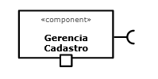
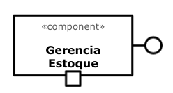
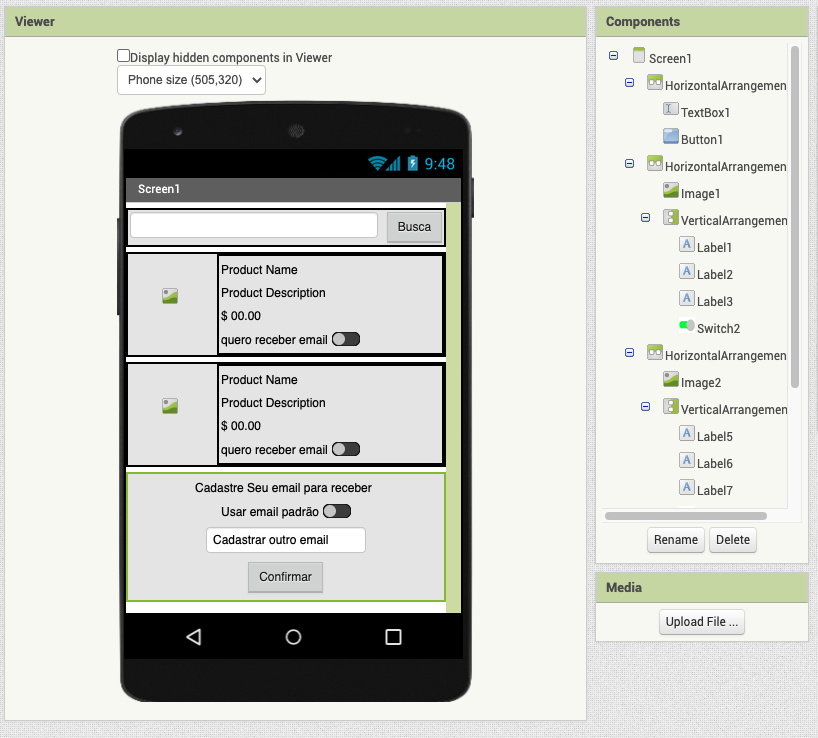

# Projeto Final - Sistema de Recomendação de Ofertas

# Equipe 3
* Jean Costa
* Lucas Franzolin
* Luis Piovan
* Marina Azevedo
* Victor Hugo Oliveira

# Nível 1

> Apresente aqui o detalhamento do Nível 1 conforme detalhado na especificação com, no mínimo, as seguintes subseções:

## Diagrama Geral do Nível 1

* O componente Lançamento assina no barramento mensagens de tópico "lancamento/{itemId}" através da interface
RecebeProposta.

* Ao receber uma mensagem de tópico "lancamento/{itemId}", o componente faz a inserção do laçamento para o marketplce através da interface PostaProsta.

* ItemOferta é atendido pelo componente Lançamento e recebe o produto a ser lançado.

* Componente Busca é responsável por encontrar um produto e assina o tópico "busca/{queryItem}" no marketplace, recebe a solicitação através da interface RecebeItemBusca.

* Interface ResultadoBusca posta no barramento o ItemBusca.

* Oferta é o componente que assina o tópico "oferta/{itemId}/item" que através da interface RecebeOferta.

* Interface PostaOferta faz a publicação da ofertas para o barramento.

* Componente Loja é o responsável por enviar ao barramento os produtos que serão disponibilizados e assina o tópico "loja/+/item" essa postagem é realizada através da interface EnviaProposta.

## Detalhamento das Interfaces

### Interface `Lançamento`

> Interface responsável por gerenciar lançamentos de produtos.

* Type: `sink`
* Topic: `lancamento/{itemId}`
* Message type: `Lançamento`

~~~json
{
  produtoId: string,

  produto: {
    preço: number,
    quantidade: number,
    frete: [
		{
        endereço: string,
		numero: number,
		bairro: string,
		cidade: string,
		estado: string,
		país: string
        }
     ]
    data: date,
    validade: date,
    Status: string
}
~~~

### Interface `Oferta`

> Interface responsável por gerenciar ofertas de produtos.

* Type: `sink`
* Topic: `oferta/{itemId}`
* Message type: `Oferta`

~~~json
{
  ofertaId: string,

  oferta: {
    preço: number,
    quantidade: number,
    frete: [
		{
        endereço: string,
		numero: number,
		bairro: string,
		cidade: string,
		estado: string,
		país: string
        }
      ]
    data: date,
    validade: date,
    Status: string
}
~~~

### Interface `Loja`

> Interface responsável pelos produtos que serão apresentados aos demais componentes do sistema.

* Type: `source`
* Topic: `oferta/{itemId}/item`
* Message type: `Loja`

~~~json
{
  lojaId: string,
  produtoId: string,
  produto: {
  produtoId: string,
  quantidade: number,
  origem: string,
  clienteID: number,
  preço: number,
  frete: [
		{
        endereço: string,
		numero: number,
		bairro: string,
		cidade: string,
		estado: string,
		país: string
        }
    ]
  }
}
~~~

### Interface `Busca`

> Interface responsável pela busca de produtos.

* Type: `source`
* Topic: `busca/{queryItem}`
* Message type: `Busca`

~~~json
{
  produtoId: string,
  produto: {
    produtoId: string,
    quantidade: number,
	origem: string,
	descricao: string
  }
}
~~~
# Nível 2
> Apresente aqui o detalhamento do Nível 2 conforme detalhado na especificação com, no mínimo, as seguintes subseções:

## Diagrama do Nível 2

> 

### Detalhamento da interação de componentes

* FAZER DETALHAMENTO

## Componente `<Gerencia Cadastro>`

> Gerencia o cadastro de usuários desde seus dados como e-mail e os interesses para recomendações de lançamentos e ofertas 

## Detalhamento das Interfaces

### Interface `<nome da interface>`

> Esse componente não possui interfaces providas.

## Componente `<Preenchimento Cadastro>`

> Realiza o cadastro e atualização dos dados de contato do usuário.

## Detalhamento das Interfaces

### Interface `<IInputInformaçõesUsuarios>`

> Inserir informações de contato do usuário

Método | Objetivo
-------| --------
`requestInformation` | `< Retorna as informações armazenadas no cadastro do usuário>`
`setRegistration` | `< Permite a inclusão de um novo usuário>`
`setEditRegistration` | `< Permite a atualização/edição de um usuário através de seu `userId`>`

## Componente `<Seleciona Tipo Lançamento>`

> Realiza o cadastro e atualização dos dados de contato do usuário.

## Detalhamento das Interfaces

### Interface `<IInputInformaçõesUsuarios>`

> Inserir informações de contato do usuário

Método | Objetivo
-------| --------
`requestInformation` | `< Retorna as informações armazenadas no cadastro do usuário>`
`setRegistration` | `< Permite a inclusão de um novo usuário>`
`setEditRegistration` | `< Permite a atualização/edição de um usuário através de seu `userId`>`

~~~
~~~

## Componente `<Gerencia Oferta Produtos>`

> Ele verifica se as ofertas tem estoque e caso afirmativo, dispara e-mails para os assinantes

**Interfaces**
> Listagem das interfaces do componente.

As interfaces listadas são detalhadas a seguir:

## Detalhamento das Interfaces

> Esse componente não tem interfaces providas

## Componente `<Gerencia Estoque>`

> Ele gerencia o estoque, sabe o número de unidades em estoque e datas de reabastecimento

**Interfaces**
> Listagem das interfaces do componente.

As interfaces listadas são detalhadas a seguir:

## Detalhamento das Interfaces

### Interface `<IVerificaDisponibilidade>`

> Essa interface é responsável por enviar a disponibilidade de estoque da Oferta

Método | Objetivo
-------| --------
`< checkAvailability >` | `< Disponibiiza a existência de estoque através do parâmetro `offerId`>`
`< checkRestockingDate >` | `< Disponibiiza data de restoque para itens sem estoque, através do parâmetro `offerId`>`
`< checkStockQtty >` | `< Disponibiiza o número de itens em estoque para itens sem estoque, através do parâmetro `offerId`>`
`< itensOn \Hold >` | `< Disponibiiza o número de itens com status on hold para [agamentos ainda não processados, através do parâmetro `offerId`>`

## Componente `<Processa Email>`

> Grenecia o envio de emails de ofertas

**Interfaces**
> Listagem das interfaces do componente.

As interfaces listadas são detalhadas a seguir:

## Detalhamento das Interfaces

### Interface `<IPreparaEmail>`

> Essa interface é responsável por preparar o e-mail com as Ofertas

Método | Objetivo
-------| --------
`< setTemplate >` | `< Permite a configuração do Template, a partir do parâmetro `htmlEmailBody`>`
`< setOffers >` | `< Permite a inserção de ofertas, pelo paraâmetro `offerId`>`
`< setDestination >` | `< Permite a configuração de destinatário, atráves do parâmetro `userId`>`

### Interface `<IEnviaEmail>`

> Essa interface é responsável por enviar a disponibilidade de estoque da Oferta

Método | Objetivo
-------| --------
`< sendToDestination >` | `< Permite o envio do email, a partir dos parâmetros `userId` e `offerId`>`

# Nível 3

> Interface App Inventor

> Diagrama de Componentes 

