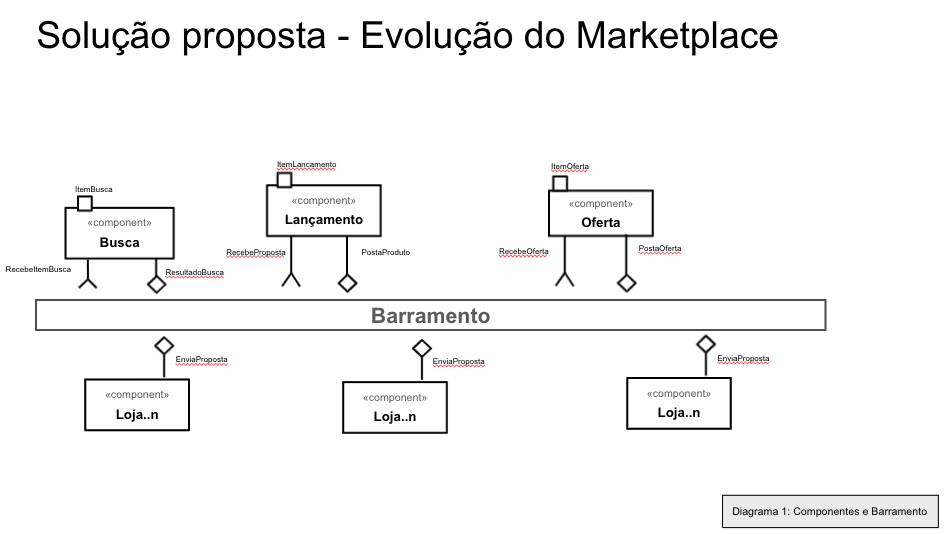
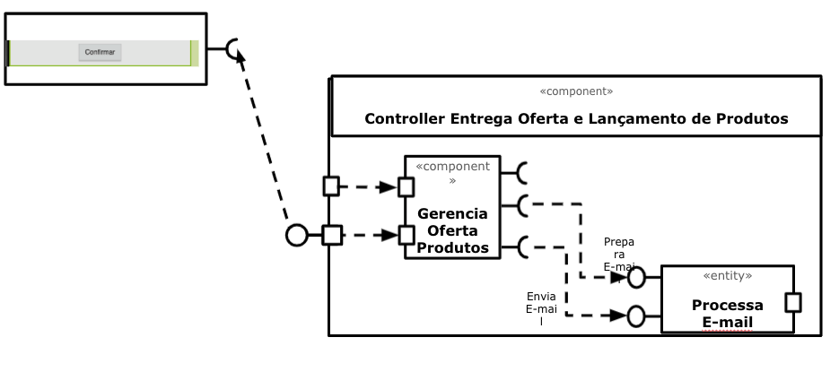

# Projeto Final - Sistema de Recomendação de Ofertas

# Equipe 3
* Jean Costa
* Lucas Franzolin
* Luis Piovan
* Marina Azevedo
* Victor Hugo Oliveira

# Nível 1

> Apresente aqui o detalhamento do Nível 1 conforme detalhado na especificação com, no mínimo, as seguintes subseções:

## Diagrama Geral do Nível 1

* O componente Lançamento assina no barramento mensagens de tópico "lancamento/{itemId}" através da interface
RecebeProposta.

* Ao receber uma mensagem de tópico "lancamento/{itemId}", o componente faz a inserção do laçamento para o marketplce através da interface PostaProsta.

* ItemOferta é atendido pelo componente Lançamento e recebe o produto a ser lançado.

* Componente Busca é responsável por encontrar um produto e assina o tópico "busca/{queryItem}" no marketplace, recebe a solicitação através da interface RecebeItemBusca.

* Interface ResultadoBusca posta no barramento o ItemBusca.

* Oferta é o componente que assina o tópico "oferta/{itemId}/item" que através da interface RecebeOferta.

* Interface PostaOferta faz a publicação da ofertas para o barramento.

* Componente Loja é o responsável por enviar ao barramento os produtos que serão disponibilizados e assina o tópico "loja/+/item" essa postagem é realizada através da interface EnviaProposta.

## Detalhamento das Interfaces

### Interface `Lançamento`

> Interface responsável por gerenciar lançamentos de produtos.

* Type: `sink`
* Topic: `lancamento/{itemId}`
* Message type: `Lançamento`

~~~json
{
  produtoId: string,

  produto: {
    preço: number,
    quantidade: number,
    frete: [
		{
        endereço: string,
		numero: number,
		bairro: string,
		cidade: string,
		estado: string,
		país: string
        }
     ]
    data: date,
    validade: date,
    Status: string
}
~~~

### Interface `Oferta`

> Interface responsável por gerenciar ofertas de produtos.

* Type: `sink`
* Topic: `oferta/{itemId}`
* Message type: `Oferta`

~~~json
{
  ofertaId: string,

  oferta: {
    preço: number,
    quantidade: number,
    frete: [
		{
        endereço: string,
		numero: number,
		bairro: string,
		cidade: string,
		estado: string,
		país: string
        }
      ]
    data: date,
    validade: date,
    Status: string
}
~~~

### Interface `Loja`

> Interface responsável pelos produtos que serão apresentados aos demais componentes do sistema.

* Type: `source`
* Topic: `oferta/{itemId}/item`
* Message type: `Loja`

~~~json
{
  lojaId: string,
  produtoId: string,
  produto: {
  produtoId: string,
  quantidade: number,
  origem: string,
  clienteID: number,
  preço: number,
  frete: [
		{
        endereço: string,
		numero: number,
		bairro: string,
		cidade: string,
		estado: string,
		país: string
        }
    ]
  }
}
~~~

### Interface `Busca`

> Interface responsável pela busca de produtos.

* Type: `source`
* Topic: `busca/{queryItem}`
* Message type: `Busca`

~~~json
{
  produtoId: string,
  produto: {
    produtoId: string,
    quantidade: number,
	origem: string,
	descricao: string
  }
}
~~~
# Nível 2
> Apresente aqui o detalhamento do Nível 2 conforme detalhado na especificação com, no mínimo, as seguintes subseções:

## Diagrama do Nível 2

> 

### Detalhamento da interação de componentes
~~~
# Nível 3

> Interface App Inventor

> Diagrama de Componentes 

